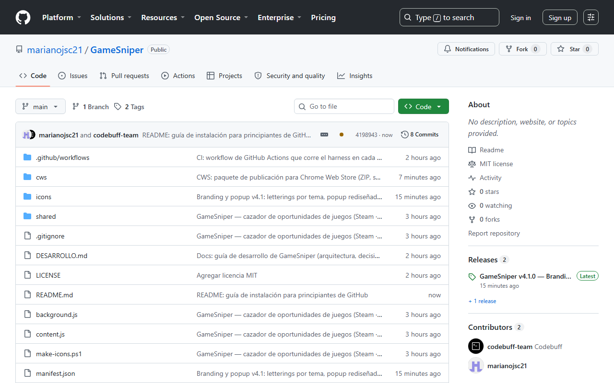
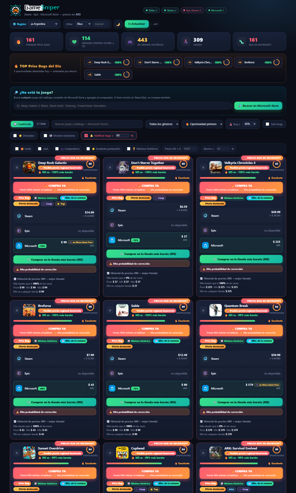

# GameSniper — Cazador de oportunidades de juegos 🎮

<p align="center">
  
  
  
  
  
  
  
</p>

Extensión de Chrome (Manifest V3) que encuentra **el precio más barato de cualquier juego en segundos** comparando **Microsoft Store, Steam y Epic Games** — precios en **ARS** por defecto, con **selector de región** para 16 países.

> Encuentra el precio más barato de cualquier juego en segundos. Compara Steam, Epic Games y Microsoft Store, detecta precios regionales mal configurados, posibles errores de precio y ofertas ocultas antes de que desaparezcan.

No es solo un comparador: es una **herramienta inteligente de oportunidades**. Detecta cuándo un juego en Steam/Epic sale "unos dólares" pero en Microsoft Store tiene un precio **bugueado / argentinizado** y sale muchísimo más barato.

## 📥 Instalación (modo desarrollador)

> ⚠️ La extensión todavía no está en Chrome Web Store. Instalarla descomprimida toma un minuto y **no necesitás saber nada de GitHub ni de programación** para hacerlo — te guío paso a paso.

### Qué es esto de GitHub (en 30 segundos)

GitHub es una página donde se guarda el código de la extensión. **No tenés que crear una cuenta ni instalar ningún programa** para instalarla: solo vas a **descargar una carpeta** y cargarla en tu navegador. Las instrucciones de abajo son para Windows con Chrome (funcionan igual en Edge y Brave, con el mismo botón *Cargar descomprimida*).

### 🟢 Camino A — Sin Git, solo con el navegador (recomendado)

> Seguí los pasos **en orden**. Después de cada uno te digo **qué deberías ver** para confirmar que vas bien. Si algo no te sale, saltá directo a [Problemas comunes](#-problemas-comunes).

**Paso 1 — Abrí la página del proyecto.**
Abrí tu navegador y escribí esta dirección en la **barra de direcciones** (la barra blanca de arriba donde aparece la dirección de la página — no la confundas con el buscador):

```
github.com/marianojsc21/GameSniper
```

Apretá **Enter**. 👉 *Deberías ver la página del proyecto: el título "GameSniper — Cazador de oportunidades de juegos" y debajo una lista de archivos.*

**Paso 2 — Descargá el código.**
Arriba a la derecha, sobre la lista de archivos, está el botón **verde** `<> Code`. Tocálo con el **clic izquierdo**. Se abre un menú desplegable: tocá la opción **Download ZIP**. 👉 *Se descarga un archivo llamado `GameSniper-main.zip` (suele aparecer abajo a la izquierda del navegador). **No lo abras todavía.***



**Paso 3 — Encontrá el archivo descargado.**
Abrí el **Explorador de archivos** de Windows (tocá la carpeta 📁 de la barra de tareas, o apretá la tecla **Windows** y escribí *Explorador de archivos*). En el menú de la **izquierda** tocá **Descargas**. 👉 *Deberías ver `GameSniper-main.zip` (puede estar mezclado con otros archivos).*

**Paso 4 — Descomprimí el ZIP.**
Hacé **clic derecho** sobre `GameSniper-main.zip` → elegí **Extraer todo…** (*Extract All…* en inglés) → en la ventana que se abre tocá **Extraer** (dejá la ubicación que viene por defecto). 👉 *Aparece una carpeta nueva llamada `GameSniper-main` al lado del ZIP.*

**Paso 5 — Entendé la estructura (el detalle más importante).**
Hacé **doble clic** sobre la carpeta `GameSniper-main` para entrar. 👉 *Adentro hay **otra** carpeta llamada `ofertas-extension`. Esa es la que se instala en Chrome.* ⚠️ *Anotá esta ruta: `Descargas → GameSniper-main → ofertas-extension`. La vas a necesitar en el paso 8.*

**Paso 6 — Abrí la página de extensiones.**
En Chrome, abrí una **pestaña nueva** y escribí en la barra de direcciones (otra vez: la barra de arriba, no el buscador):

```
chrome://extensions
```

Apretá **Enter**. (En Edge: `edge://extensions`. En Brave: `brave://extensions`.) 👉 *Se abre la página de extensiones de tu navegador.*

**Paso 7 — Activá el modo de desarrollador.**
Arriba a la **derecha** de esa página hay un interruptor que dice **Modo de desarrollador**. Tocálo para encenderlo (queda azul/marcado). 👉 *Arriba a la izquierda aparecen botones nuevos, entre ellos **Cargar descomprimida**.*

**Paso 8 — Cargá la carpeta de la extensión.**
Tocá el botón **Cargar descomprimida** (*Load unpacked* en inglés). Se abre una ventana para elegir carpeta. Navegá hasta `Descargas → GameSniper-main`, tocá **una sola vez** sobre la carpeta `ofertas-extension` (queda resaltada) y tocá el botón **Seleccionar carpeta** (o *Select Folder*). ⚠️ *Si elegís la carpeta `GameSniper-main` o `Descargas` directamente, te va a salir el error "Falta el archivo de manifiesto". Siempre la `ofertas-extension`, la que está **dentro** de `GameSniper-main`.*

**Paso 9 — Verificá que se instaló.**
👉 *Aparece una tarjeta nueva en la página de extensiones con el nombre "GameSniper — Cazador de oportunidades de juegos", la versión y el ícono. Si la ves, ya está instalada.*

**Paso 10 — Fijá el ícono en la barra del navegador.**
Mirá la barra superior del navegador, a la derecha de la barra de direcciones. Si **no** ves el ícono de GameSniper, tocá el ícono de **rompecabezas 🧩** → buscá "GameSniper" en la lista → tocá el **alfiler 📌** que está al lado para fijarlo. 👉 *El ícono de GameSniper queda visible en la barra.*

**Paso 11 — Usala por primera vez.**
Tocá el **ícono de GameSniper** que fijaste en el paso 10. Se abre el popup de la extensión. Tocá el botón **VER OPORTUNIDADES**. 👉 *Se abre la página de ofertas y empieza a escanear precios en Steam, Epic y Microsoft Store. La primera vez tarda unos segundos; después usa caché y es casi instantáneo.*

**Paso 12 — (Opcional) Actualizar cuando haya versiones nuevas.**
Repetí los pasos 2 a 4 (volvé a descargar y extraer el ZIP; la carpeta nueva reemplaza a la vieja con el mismo nombre). Después, en `chrome://extensions`, tocá el botón **↻** (recargar) que está en la tarjeta de GameSniper. 👉 *La extensión queda actualizada sin perder tus preferencias.*

> 📦 **¿Descargaste el ZIP desde "Releases" (GameSniper-v4.1.0.zip) en vez del botón Code?** Ese ZIP tiene otra estructura: el `manifest.json` está **directamente** dentro de la carpeta extraída (no hay `ofertas-extension` adentro). Entonces en el paso 8 elegís la carpeta extraída tal cual, sin entrar a ninguna subcarpeta.

### 🔵 Camino B — Con Git (para los que quieren actualizaciones fáciles)

Si ya usás Git (o querés aprender), además podés clonar el proyecto y actualizarlo con un solo comando cuando haya versiones nuevas. Abrí una terminal (en Windows: apretá **Windows** y escribí *cmd* o *PowerShell*) y escribí:

```bash
git clone https://github.com/marianojsc21/GameSniper.git
```

Después, para actualizar a la última versión:

```bash
cd GameSniper
git pull
```

Y recargás la extensión en `chrome://extensions` (botón ↻). Con el Camino A (ZIP) tenés que volver a descargar el ZIP en cada actualización; con Git es un solo comando.

### 🆘 Problemas comunes

| Qué ves | Por qué pasa | Solución |
|---|---|---|
| **"Falta el archivo de manifiesto o no se puede leer"** | Elegiste la carpeta equivocada en el paso 8 | Seleccioná la carpeta **`ofertas-extension`** (la que contiene el `manifest.json`), no la `GameSniper-main` ni `Descargas` |
| **No veo el botón "Cargar descomprimida"** | El modo de desarrollador está apagado | Activá el interruptor **Modo de desarrollador** (paso 7) — sin eso el botón no existe |
| **No veo el ícono de GameSniper en la barra** | El ícono está oculto en el menú 🧩 | Tocá el rompecabezas 🧩 y fijá GameSniper con el alfiler 📌 (paso 10) |
| **Chrome no me deja cargar la carpeta ("La extensión está dañada")** | Se seleccionó el ZIP sin extraer, o la extracción quedó incompleta | Extraé el ZIP primero (paso 4) y elegí la carpeta extraída, nunca el archivo `.zip` |
| **La extensión carga pero no muestra precios** | Es el primer escaneo o no hay internet | Esperá unos segundos; si sigue, tocá **↻ Actualizar** en la página de ofertas y fijate que tengas conexión |
| **Después de actualizar veo la versión vieja** | Chrome no recargó la extensión | En `chrome://extensions` tocá el botón **↻** de la tarjeta de GameSniper; si no, cerrá y abrí el navegador |

> 💻 **¿Usás Mac?** El proceso es el mismo, con dos diferencias: para descomprimir hacé **doble clic** sobre el ZIP (macOS lo extrae solo) y el botón del navegador se llama igual (*Load unpacked* / *Cargar descomprimida*).

## 📸 Vista previa



## Cómo funciona

1. **Popup** (icono de la extensión): botón **VER OPORTUNIDADES** que abre la página del comparador en una pestaña aparte, con stats rápidas, la **mejor oportunidad** del último scan (score más alto) y su link directo.
2. **Página de ofertas** (`offers.html`): escanea el catálogo de **200 juegos** (AAA + clásicos, todos con appid de Steam verificado) en las 3 tiendas:
   - **Steam** — API pública `store.steampowered.com/api/appdetails` (`cc=AR`, precios en USD).
   - **Epic Games** — GraphQL público `store.epicgames.com/graphql` (`searchStore`, precios en USD).
   - **Microsoft Store** — API `storeedgefd.dsx.mp.microsoft.com/v9.0/search` (`market=AR`, precios en ARS).
   - **Dólar** — `dolarapi.com` (blue / oficial / tarjeta) para convertir USD → ARS.

El catálogo se puede **filtrar por género** (Acción, RPG, Shooter, JRPG, Carreras, Estrategia, etc.) desde el select de la toolbar, y combina con la búsqueda por nombre, el orden y el toggle "solo bugs". Los resultados se cachean 30 minutos en `chrome.storage.local`.

## Inteligencia de oportunidades

- **🚨 Detector de price bugs**: marca **"Posible error de precio"** cuando MS sale **≥ 40%** (umbral configurable 40/50/60/70%) más barato que el mejor precio USD (Steam/Epic) convertido a ARS.
- **🚨 Detector de regionalización**: cuando el precio es **≥ 65% más barato** (ratio ≤ 0.35) se marca **"Posible precio regional incorrecto"** (argentinizado / mal configurado).
- **🔥 Opportunity Score (0–100)**: cada juego recibe un score que pondera ahorro, tipo de anomalía, riesgo de corrección, popularidad, tiempo que lleva la oferta, tendencia del precio y descuento oficial. El anillo en cada card muestra el score.
- **⚠️ Probabilidad de corrección**: estima cuán probable es que el precio se corrija o desaparezca pronto (alta / media / baja), basándose en magnitud, frescura y tipo.
- **📈 Historial de precios**: se guardan snapshots por juego (últimos 90, sin duplicados en 30 min) con **sparkline** y comparación "hace 24 h / 1 semana / 1 mes".
- **🏆 Mínimo histórico en cualquier tienda**: el histórico mínimo no es solo del precio MS: se calcula sobre el **mejor precio de compra en ARS entre Steam/Epic/MS** (`bestArs`) y el bloque de historial muestra "Mín en cualquier tienda".
- **📅 Mínimo de la semana**: badge en la card cuando el precio MS actual **iguala el mínimo de los últimos 7 días** (chip `📅 Min. de la semana` e indicador en la vista lista).
- **⛔ Se acabó la oportunidad**: cuando un price bug fue **corregido** (el precio MS subió ≥ 20% respecto del último precio bugueado y ya no es una anomalía), la card muestra "⛔ Se acabó la oportunidad" con el precio anterior y el nuevo (+%), aparece el chip "Oportunidad agotada" y la vista lista agrega el indicador ⛔.
- **🔥 TOP Price Bugs del Día**: sección destacada con los 5 juegos de mayor ahorro, ordenados por porcentaje.
- **🎁 Gratis esta semana en Epic**: la extensión consulta los **juegos gratis semanales** de Epic (`category: "freegames"` en el GraphQL público) y los muestra en una sección dedicada con el **precio original** tachado, un **countdown en vivo** ("Quedan Xd Xh") y botón **Reclamar →** que abre la página del juego en Epic. Se actualiza automáticamente cada 12 h (caché propia `ofertasEpicFree`) y el popup agrega el chip **"🎁 Epic regala N"**. Las URLs se arman con `offerMappings[].pageSlug` / `catalogNs.mappings[].pageSlug` cuando `productSlug` viene null (shape real de la API, locale en-US).
- **🎁 Inyección en el catálogo**: cuando un juego del catálogo **coincide exactamente** con un gratis semanal activo de Epic (matching por título normalizado, sin falsos positivos por substring), la columna Epic de su card muestra **"🎁 GRATIS en Epic"** con la **URL de reclamo** de Epic y el juego **compite como mejor precio** (vale $0 en la comparación). Si la semana termina, la card vuelve a sin-datos en la columna Epic. La lógica de matching (`epicFreeCatalogMap`) vive en `shared/util.js` y está cubierta por tests.
- **🛒 Botón inteligente**: "Comprar en la tienda más barata" abre directamente la tienda con el mejor precio.

## 🔔 Notificaciones automáticas

Cada scan envía el resultado a un **service worker** (`background.js`) que:
- Muestra un **badge rojo en el ícono** con la cantidad **total** de precios bugueados del último scan (se actualiza en cada búsqueda).
- Envía **UNA notificación diaria con el TOP Price Bugs del Día** (default **10:00**, hora local) solo cuando hay **≥ 1 oportunidad real**: lista los 5 juegos de mayor ahorro con su %. No spamea: se deduplica por día calendario y solo cuenta anomalías con precio MS de compra válido (Game Pass-only y gratis quedan fuera).
- El clic en la notificación abre Microsoft Store del juego.

El umbral y el toggle están en la toolbar de la página de ofertas (`🔔 Notificar bugs ≥ XX%`) y se guardan en `chrome.storage.local`. Las notificaciones individuales por scan fueron reemplazadas por el TOP diario (una al día, sin ruido).

**🎁 Nuevos gratis de Epic**: una alarma one-shot diaria (default **13:00** local, 1 h después de la rotación de Epic del jueves a las 15:00 UTC = 12:00 AR) detecta cuándo **rotan los juegos gratis semanales** y envía una notificación **"🎁 ¡Nuevos gratis en Epic!"** con el listado (máx. 5 + "N más"). El clic abre el comparador. **Dedupe por semana**: se guarda la semana activa (`weekKey` = min `startDate` de la rotación) y los títulos ya notificados; solo avisa cuando cambia la semana o se agregan títulos a mitad de semana. El **primer chequeo** solo establece la línea base (sin notificar, para no spamear al instalar). Reutiliza la caché `ofertasEpicFree` (TTL 12 h) para no duplicar consultas. La lógica pura (`epicFreeActive` / `epicFreeWeekKey` / `epicFreeNewTitles`) vive en `shared/util.js` y está cubierta por tests.

## ⭐ Lista de Deseados Inteligente

Cada card tiene un botón de deseo (⭐). La extensión vigila los juegos deseados con una **alarma en segundo plano** (`chrome.alarms`, cada 30 min) y notifica **solo cuando ocurre un evento real**, sin spam:

- **Baja de precio** superior al % configurado (default 15%).
- **Nuevo mínimo histórico**.
- **Posible error de precio** (supera el umbral de bug).
- **Microsoft Store pasa a ser la tienda más barata**.
- **Epic regala el juego** (precio USD = 0).

La lógica de eventos (`wishEvents`) compara el snapshot anterior con el actual; cada evento se notifica una sola vez. El toggle **⭐ Deseados** en la toolbar filtra la grilla.

## 📊 Dashboard y filtros inteligentes

- **Dashboard** arriba de todo: 🔥 Posibles Price Bugs · 💚 Grandes ofertas (score ≥ 70) · 🎮 Juegos en mínimo histórico · 📈 Juegos que subieron hoy.
- **Historial enriquecido** por juego: más barato que el X% de las veces, última vez a este precio, precio promedio, mínimo y máximo histórico (además del sparkline y la comparación 24 h / semana / mes).
- **🚨 Alertas urgentes**: cuando la diferencia es extrema (ahorro muy alto + riesgo de corrección) la card muestra un banner destacado **"🔥 COMPRA YA"** con el % de ahorro. Solo casos excepcionales.
- **Filtros inteligentes** en la toolbar: Solo bugs · 🎁 Gratis · AAA · 👥 Cooperativos · ⭐ Excelente puntuación · 🏆 Mínimos históricos · Precio MS ≤ monto · Ahorro ≥ %. Se combinan entre sí y con la búsqueda y el género. El filtro **Gratis** muestra juegos que se consiguen gratis de verdad (sin suscripción) en cualquier tienda: regalos semanales de Epic, juegos free-to-play de Steam o títulos gratuitos reales de Microsoft Store (Game Pass-only NO cuenta, requiere suscripción).
- **Sección de gratis**: además del grid, la sección **🎁 Gratis esta semana en Epic** arriba con cards clicables (consulta en vivo al GraphQL público de Epic, con countdown y botón Reclamar).
- **Score 0–100** con barra visual y valoración clara (Excelente / Muy buena / Buena / Oportunidad leve).

## 💉 Precio MS inyectado en Steam/Epic (content script)

Mientras navegás la **página de un juego en Steam** (`/app/<id>`) o **Epic** (`/p/<slug>`), el content script (`content.js`) detecta el juego y le pide al service worker la comparación en vivo:

- Card flotante (shadow DOM, no rompe el CSS de la página) con el **precio de Microsoft Store en ARS** y el mejor precio Steam/Epic convertido.
- **Doble opción en Game Pass**: si el juego está **incluido con Xbox Game Pass** y además MS Store tiene **precio de compra propio**, la card muestra el badge 🎮 *"Incluido con Xbox Game Pass"* y **debajo el precio de compra en ARS** ("o compralo por $X") — la suscripción y la compra se ven sin salir de la página. Si no hay precio de compra, solo se muestra el badge.
- Si MS sale **≥ 40% más barato**, banner 🔥 con el % de ahorro.
- Botón **Ver en MS →** (abre el juego en Microsoft Store) y **Comparador** (abre la página de ofertas).
- Soporta navegación SPA de Epic (detecta cambios de URL).

El fetch lo hace el background (`oferMsCheck`), así que no hay problemas de CORS. La card ahora también muestra el **🚨 tipo de anomalía** y el **Opportunity Score / 100**.

## 🔲 Vistas múltiples: Cuadrícula y Lista

El comparador ofrece **dos modos de visualización** intercambiables desde el toggle de la toolbar (`🔲 Cuadrícula` / `≣ Lista`), y **recuerda la última vista elegida** (`chrome.storage`):

- **🔲 Cuadrícula**: cards visuales con imagen, nombre, precio más barato, tienda recomendada, % de ahorro, Opportunity Score e indicadores (🔥 Price Bug · 💚 Mejor precio · 📉 Mínimo histórico · ⭐ Oferta destacada).
- **≣ Lista**: filas compactas orientadas a comparar muchas ofertas rápido: imagen, nombre, precios Steam / Epic / Microsoft, tienda más barata, % de ahorro, score y botón Comprar.

**Ordenamiento** en ambas vistas: 🔥 Oportunidad primero, mayor ahorro, mayor score, menor precio, descuento, más recientes, nombre, precio Steam, precio Epic y precio MS. El orden elegido **también se recuerda** entre sesiones.

**Encabezados clicables** (vista Lista): los encabezados **Steam · Epic · Microsoft · Mejor · Ahorro · Score** son botones de orden. Un clic ordena **ascendente** (▲, menor primero), otro clic **descendente** (▼, mayor primero), con el indicador ▲/▼ en la columna activa. La dirección también se guarda en `chrome.storage` (`ofertasSortDir`) y se restaura al volver a abrir. La lógica (`compareBySortDir` + `NATURAL_DIR` en `shared/util.js`) es pura y testeable.

**Rendimiento y arquitectura**: cambiar de vista es **instantáneo** — no se re-consultan tiendas; se reutilizan los datos ya cargados (`state.games`) y solo cambia la presentación. Los comparadores de orden (`compareBySort`) son funciones puras en `shared/util.js`, desacopladas del DOM, para que agregar vistas nuevas no toque la lógica de datos.

## 🌙 Tema claro / oscuro

Un toggle en la toolbar (arriba, junto a Actualizar) cambia entre **tema oscuro** (default) y **tema claro premium**:

- **Tema oscuro** (default): la paleta actual — fondo profundo azul-negro con glows, paneles `#131a2b`.
- **Tema claro premium**: versión equivalente y cuidada — fondo gris-azulado claro, paneles blancos, textos oscuros de alto contraste y acentos re-entonados (MS, Steam, Epic, gold, hot) para mantener la legibilidad.
- La elección **se guarda en `chrome.storage.local`** (`ofertasTheme`) y **se restaura al abrir** la página o el popup; ambos comparten la misma preferencia.
- Se aplica en `<html data-theme="light">`: todas las superficies usan **variables CSS semánticas** (`--panel`, `--line`, `--text`, `--muted`, `--chip-bg`, `--row-bg`, `--track`, …), así el tema claro ajusta también fondos de filas, pistas de score, art placeholders y glows, no solo el fondo.
- **Transición suave**: al togglear el tema, la página agrega por ~450ms la clase `theme-transition` que activa transiciones CSS (background-color, color, border-color, box-shadow, fill, stroke) para un crossfade premium. El primer paint de `init()` **no** la activa (nada parpadea al abrir), y `prefers-reduced-motion` la desactiva. El **popup** usa el mismo mecanismo (misma clase en `popup.css` y `applyTheme(theme, animate)` en `popup.js`), así que el crossfade es consistente desde el ícono de la extensión.

## ✅ Calidad de datos (confianza primero)

La extensión **prefiere ocultar datos dudosos antes que mostrar información engañosa**. Cada precio mostrado representa una opción real de compra:

- **🎮 Xbox Game Pass ≠ Gratis**: la API de MS Store expone a nivel card `DisplayPrice` ("Incluido"), `PlaintextPassName` / `GlyphTextPassName` (Xbox Game Pass). La extensión distingue:
  - **Incluido con Xbox Game Pass** — se muestra "🎮 Incluido con Xbox Game Pass", nunca "Gratis".
  - **Gratuito real** (F2P, sin suscripción) — se muestra "Gratis".
  - **De pago** — precio real de compra; si además está en Game Pass, se agrega la nota "🎮 en Game Pass".
- **Solo comparaciones reales**: por defecto solo se muestran juegos con precio en **al menos 2 tiendas** (comparables). Los exclusivos de una sola tienda quedan ocultos; el toggle **👀 Mostrar exclusivos** los revela.
- **Validación de disponibilidad** antes de comparar: existe en la tienda, tiene precio de compra real, o es gratis de verdad. Un juego sin precio nunca se asume gratuito.
- El botón comprar apunta a la tienda con el **precio real de compra** más barato (o "Obtener gratis" si la mejor opción es gratuita). Game Pass-only no compite como "más barata".

## ⚡ Optimización y caché inteligente

- **Caché por tienda con TTL configurable** (`shared/db.js`): Steam 60 min (batch), Epic 45 min, Microsoft 30 min. Antes de consultar se verifica si la información sigue siendo válida (`DB.storeFresh`); solo se actualiza lo que expiró.
- **Capa de datos local** (`shared/db.js`): guarda nombre, IDs, precios de las 3 tiendas, fecha de actualización e historial, desacoplada de la interfaz.
- **Actualización en segundo plano**: se muestran los datos cacheados al instante y el scan refresca silenciosamente; si un precio cambió, la interfaz se actualiza sola.
- **Prioridad de actualización**: los juegos **deseados** se re-chequean en background (alarms) con más frecuencia; el resto solo cuando expira su TTL.
- **Consultas por lotes**: Steam se consulta de a muchos en una llamada; Epic/MS usan un pool con concurrencia acotada (5) para no disparar cientos de requests ni parecer scraping agresivo.
- **Listo para backend**: toda la persistencia pasa por `DB`; en el futuro un servidor central puede reemplazar las implementaciones internas manteniendo la misma API.

## Arquitectura escalable (tiendas modulares)

`shared/stores.js` usa un **registro de tiendas** (`STORES`) donde cada tienda es un módulo independiente: `{ id, label, color, batch, termOf, fetch }`. Para agregar **GOG, Ubisoft, EA App, Battle.net, GreenManGaming, Fanatical, Humble Bundle…** solo hay que:

1. Escribir el módulo con su `fetch` (y parse de precios).
2. Registrarlo en `STORES`.
3. Sumar el `host_permission` en `manifest.json`.

El resto del código (página, popup, content script, notificaciones) lo consume dinámicamente sin cambios.

## Notas

- Los precios USD de Steam/Epic se convierten con la tasa de dólar seleccionada (por defecto **blue**). Podés cambiarla a oficial, tarjeta o manual desde la página.
- Si una tienda no tiene el juego (p. ej. títulos retirados de la región AR en Epic), se muestra "no disponible".
- Los datos provienen de APIs públicas no oficiales; pueden cambiar o fallar. La extensión degrada con elegancia (mensajes por tienda).
- Los appids de Steam del catálogo fueron verificados contra `store.steampowered.com/api/appdetails` (los que apuntaban a otro juego fueron corregidos).

## Estructura

```
ofertas-extension/
├── manifest.json
├── popup.html / popup.css / popup.js     # popup GameSniper + stats rápidas
├── offers.html / offers.css / offers.js  # página comparadora (dashboard, filtros, deseados)
├── shared/
│   ├── util.js      # normalización, matching, formato, análisis (bug/regional/riesgo/score), histStats, wishEvents
│   ├── db.js        # capa de datos local: caché por tienda con TTL, historial, snaps, wishlist (backend-ready)
│   ├── background.js # badge + notificaciones + alarmas de deseados + consultas puntuales (service worker)
│   ├── content.js    # inyecta el precio de MS en páginas de Steam/Epic
│   ├── catalog.js   # 200 juegos con appids de Steam (verificados contra la API) y género
│   └── stores.js    # registro modular de tiendas (fetch + parse) y el dólar
├── icons/           # íconos PNG (generados con make-icons.ps1)
└── test-logic.html  # harness de tests de lógica (Chrome headless)
```

## Tests

```
chrome.exe --headless=new --disable-gpu --dump-dom file:///…/test-logic.html
```
Debe imprimir `PASS` en todas las aserciones (matching, formato, conversión, catálogo: 200 juegos con genre válido, detectType, correctionRisk, opportunityScore, historial, registro de tiendas, db con TTL y wishlist, isAaa/isCoop/isTopRated, histStats, isUrgent, wishEvents, storeOfferKind/availableStoreCount, isHistoricLow con gratis, isHistoricLowAny / isWeeklyLow, compareBySort en los 9 criterios, topBugs del TOP diario, opportunityGone de "se acabó la oportunidad").
